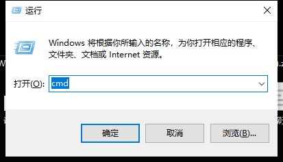
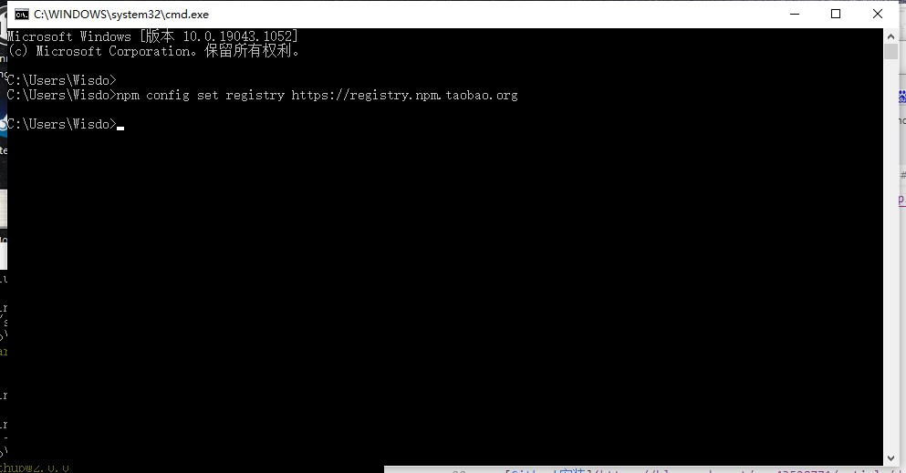

# Readme

**Mapull的教程,将gitbook讲解的非常细致,本人就经常使用他,本文使用的大部分插件,都是从他那边得知的**
- [Mapull](https://www.mapull.com/gitbook/comscore/custom/plugin/other/math.html)

本文作为Gitbook的一个空白模板可以直接使用

请打开 Book文件夹

需要运行书本的话,就点击"运行书本.bat"

如果修改了插件,book.json,就点击"更新插件.bat"

打开后访问 http://localhost:4000
## 资源准备
详见"安装包"已经有相关安装包了
- 如果你可以点开64的,就不需要点32
- 如果你点不开64的再点32
- 64和32只需要安装一个,能点64,尽量64
- **买电脑上bing搜bilibili找AS极客**
- [Node](https://nodejs.org/dist/latest-v10.x/)
- [BandZip](http://www.bandisoft.com/bandizip/)

## 教程
- [Gitbook安装](https://blog.csdn.net/qq_43528771/article/details/107949010)
- [Gitbook自动构建](https://www.cnblogs.com/phyger/p/14035937.html#Github_Actions_911)

## 淘宝NPM镜像

由于GreatFireWall在把大部分应该封禁的境外网站的同时
也很大影响了程序员等高级人才的需求
因此我们需要使用淘宝镜像来加速开发

> 如果说,共享知识与生产资料也属于共产的一部分
> 那么github和gitbook就是最共产的东西了

1. 按下"Win"+R
2. 输入cmd后回车

```bash
npm config set registry https://registry.npm.taobao.org
```



## 有用的链接
- **重点**[Overleaf](https://www.overleaf.com/)
- [FontAwsome](https://www.runoob.com/font-awesome/fontawesome-reference.html)
- [Spring](https://www.w3cschool.cn/wkspring/)
- [BootStrap](https://www.runoob.com/bootstrap/bootstrap-tutorial.html)
- [HTML](https://www.runoob.com/html/html-tutorial.html)
- [CSS](https://www.runoob.com/css/css-tutorial.html)
- [微信开发](https://daixiang.blog.csdn.net/article/details/91392943)
- **重点**[KTor](https://ktor.kotlincn.net/quickstart/index.html)
- **重点**[图灵学院](https://space.bilibili.com/458147808/video)
- [Honkit](https://github.com/honkit/honkit)
- [MulanLicense](https://license.coscl.org.cn/MulanPSL2/index.html)

## 新晋语言

**没有最好的语言,只有最合适的语言.**
**和决策一样,任何决策都是好坏参半的,扩大好的部分,压制坏的部分**

- [ERLang](https://www.erlang.org/) 听其他游戏工程师说很完美,作为服务器,其实很老的
- [Dart](https://dart.cn/) 也不算老,但是他是最近才进入大众视野的

## 自动构建

- [官方文档](https://docs.github.com/cn/actions/quickstart)
